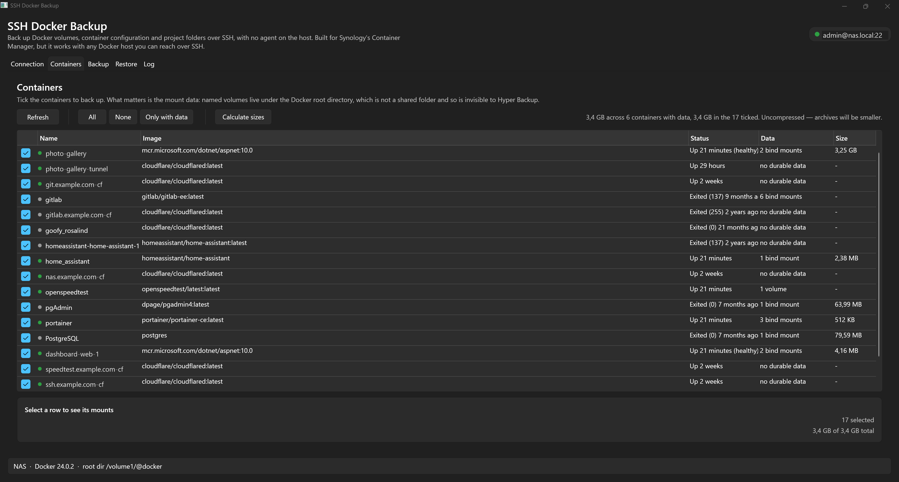
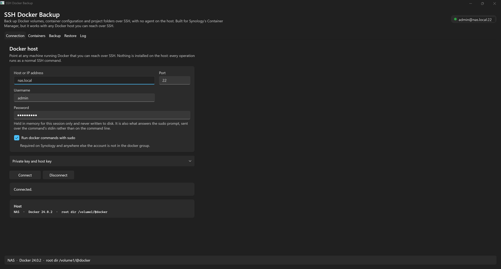
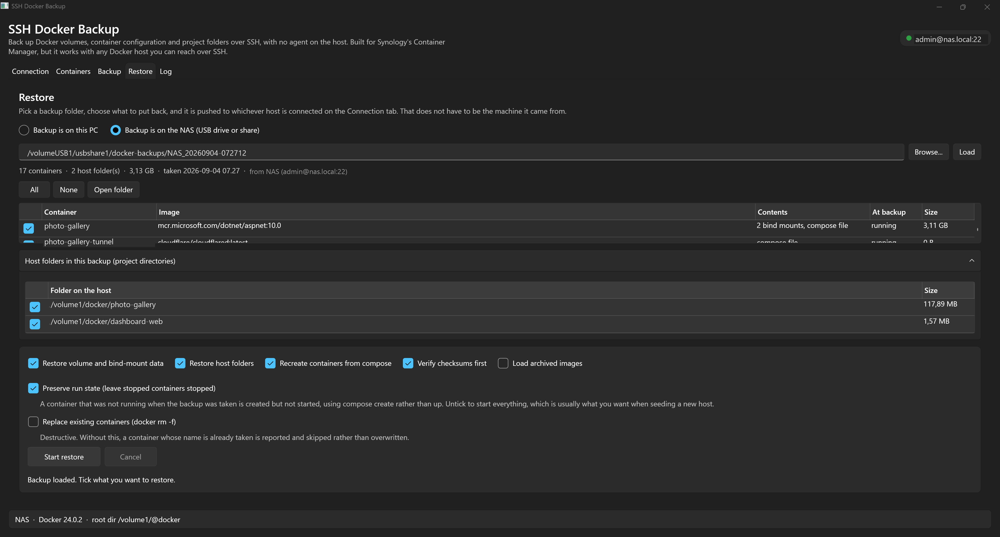

# SSH Docker Backup

[](https://github.com/CarstenKnop/synology-docker-backup/actions/workflows/build.yml)
[](LICENSE)
[](https://dotnet.microsoft.com/)

### Your NAS backup probably isn't backing up your containers.

Named volumes live under the Docker root directory, which is **not a shared folder** — so Hyper
Backup never sees them. Every database in Container Manager can be missing from a backup that looks
complete, and you find out at the worst possible moment.

This backs up all three parts of a container — its **data**, its **configuration** and its
**images** — over plain SSH, and puts them back.



## Why this one

**Nothing is installed on the host.** No agent, no exposed Docker socket, no `NOPASSWD` sudoers
rule, no SSH key to deploy. Every operation is an ordinary SSH command using the password you
already have, and nothing is left behind on the NAS afterwards.

**It restores — it does not just archive.** Volume-backup tools put bytes back into a volume. This
recreates the container: its image, its ports and environment, its fixed network address, the run
state it had at backup time, and its entry in Container Manager's Project list.

**It works with no internet.** Images are saved by default, so a restore does not depend on a
registry still having the version you were running. `:latest` is a moving pointer, and a database
directory written by an older major version will simply refuse to start.

**It writes where it is fast.** Pointed at a USB drive on the NAS, tar redirects straight to that
disk and nothing crosses the network. It also warns you when the destination shares a filesystem
with the containers, because a backup on the volume that dies is not a backup.

### Verified, not assumed

On 9 September 2026 this backed up 17 containers (2.91 GB), then every container, network and
Container Manager project was deliberately deleted from the NAS. All 17 came back: 11 running and 6
stopped, matching their state at backup time, on three networks rebuilt with their original subnets,
inside their original projects. Public sites served by those containers were back without further
intervention.

The findings that shaped the design — and the honest comparison against Portainer, Dockge and the
volume-backup tools — are in [DESIGN.md](DESIGN.md).

## What it captures, and why

A container backup is three separate things, and most people only lose one of them:

| Part | Where it lives | Captured as |
|---|---|---|
| Run configuration | Docker metadata | raw `docker inspect` JSON, plus a generated compose file |
| Named volume data | `<docker root>/volumes/<name>/_data` | gzipped tar |
| Bind mount data | a normal path such as `/volume1/docker/app` | gzipped tar |
| Project folders | any host path you nominate | gzipped tar |
| Local-only images | the Docker image store | `docker save`, gzipped |

Three things are easy to lose here, and the tool is shaped around them:

**Named volumes are the trap.** They live under the Docker root directory, which is not a Synology
shared folder, so Hyper Backup never sees them. A NAS backup that looks complete can be missing every
database in Container Manager.

**Project folders are mounted into nothing.** A directory like `/volume1/docker/myapp` holds
the compose file, Dockerfile, `.env` and helper scripts, and typically only a *subfolder* of it is
bind-mounted. Follow the mounts and you capture the data but not the thing that builds it. Add such
folders under **Host folders** on the Backup tab, or press **Find project folders** to have the app
climb up from every bind mount looking for a compose file or Dockerfile.

**Locally built images cannot be pulled back.** An image that came from a registry carries a
RepoDigest (`repo@sha256:…`); one built with `docker build` on the NAS has none. That is the test the
app uses to tell them apart.

The default is `All` — every image is saved. Re-pulling looks like the thrifty choice until you need
it: most images are tagged `:latest`, which is a moving pointer rather than a version, so restoring a
year later fetches *different software*, and a database whose data directory was written by an older
major version will simply refuse to start. Saving the image pins what actually ran and removes any
dependency on the host having internet at restore time. `LocalOnly` saves just the images nothing
else can supply, and `None` saves nothing but lists in the backup's README.txt every local-only image
it skipped, so the loss is at least visible.

Images are deduplicated by content ID rather than by name, because one image can be referenced two
ways — `postgres` by one container and `postgres:latest` by another are the same image, and keying on
the text stores it twice.



## Where the backup goes

Two destinations, chosen on the Backup tab:

- **This PC** — tar's output is streamed back over the SSH channel into a local file.
- **A folder on the NAS** — tar redirects straight into a file on that disk. Nothing crosses the
  network, which for a large volume is dramatically faster. Intended for a USB or eSATA drive
  attached to the NAS; **Browse** lists every mounted volume with its free space and lets you create
  a folder without leaving the app.

Restore mirrors this: a set stored on the NAS is unpacked by tar reading the archive in place, again
with nothing crossing the network.

A word of warning the app also logs: writing a backup onto the *same filesystem* it came from
protects against nothing, since the volume that dies takes both copies. The app compares the
destination's mount point with the Docker root's and warns when they match. A separate USB drive is a
different mount, and therefore fine.

Because there is no byte stream to count when writing on the host, progress there comes from
measuring the growing file rather than from the transfer itself.

## Layout of a backup set

```
<destination>/<hostname>_<yyyyMMdd-HHmmss>/
    manifest.json      index of everything; written last, so its presence means the run completed
    README.txt         generated summary, including anything that failed
    containers/        <name>.inspect.json — the authoritative rebuild recipe
    compose/           <name>.docker-compose.yml — best effort, review before use
    volumes/           named-volume data
    binds/             bind-mount data
    paths/             host folders you nominated, such as project directories
    images/            images that cannot be pulled again, plus any others you asked for
```

> **The backup folder is sensitive.** The inspect JSON and compose files reproduce every container
> environment variable in plaintext, which for most stacks means database passwords and API keys.
> Encrypt it before it goes off-site.

## Design notes

Fuller rationale — what an audit of one real 17-container host actually found, why backups are hard
in the first place, how this compares to Portainer, Dockge and the volume-backup tools, and where it
should go next — is in [DESIGN.md](DESIGN.md).

Three host quirks shaped the implementation:

- **No SFTP.** DSM ships with the SFTP subsystem disabled, so SCP and SFTP both fail. All file
  transfer streams through a plain exec channel instead: `tar czf -` on the way out, `tar xzf -` on
  the way back, piped straight to and from a local file. Nothing is buffered in memory, so volume
  size is bounded by disk, not RAM.
- **sudo's restricted `secure_path`.** DSM's sudoers omits `/usr/local/bin` and `/usr/sbin` — which
  is why `sudo visudo` reports "command not found" there, and would do the same for `docker`. Every
  command therefore sets its own `PATH` inside the remote shell.
- **sudo needs a password, and it should not be on the command line.** The password is written to the
  command's **stdin** (`sudo -S -p ''`), so it never appears in `ps`, in shell history, or in the
  app's own logs. For uploads, sudo consumes one line and then execs `tar`, which goes on reading the
  same descriptor — so the archive simply follows the password down the same pipe.

Consequently the app needs **no `NOPASSWD` sudoers rule and no SSH key**: it works with the password
you already have, and leaves nothing behind on the NAS.

## Permissions and ownership

Everything runs under `sudo`, so reading is never the problem — root can read any share regardless of
its DSM permissions. What matters is what survives the round trip:

- **Ownership and mode bits**: preserved. `tar --numeric-owner` stores raw uid/gid pairs rather than
  resolving names, because container users (`uid 1000`, `abc`, `postgres`) rarely exist in the NAS
  passwd file and resolving them would silently rewrite ownership on restore.
- **Synology ACLs**: preserved *when the host's tar supports it*. DSM keeps its ACLs in extended
  attributes, which plain tar drops. The app probes `tar --help` once per connection and adds
  `--xattrs --xattrs-include='*' --acls` when they are available (the include pattern matters:
  GNU tar stores only `user.*` xattrs by default, and Synology's live in `system.*`/`security.*`).
  If the host's tar lacks them you get a warning in the log, and permissions still come back — only
  the ACLs do not.
- **Share-level permissions** are DSM configuration, not filesystem state. Those come back from DSM's
  own Configuration Backup, not from this tool.

## Sources that cannot be archived

Docker records a bind mount's source path whether or not anything is still there, and not every
source is a directory. Three cases are handled explicitly rather than being allowed to fail:

- **Missing** — the container references a path that has since been moved or deleted. Recorded as
  skipped, not as an error. The container's configuration is still captured, so it remains
  rebuildable even though its data is gone.
- **A single file** — `/etc/ssl/site.crt` and the like. tar cannot `chdir` into a file, so these are
  archived by name from the parent directory (`-C /etc/ssl site.crt`) and restored into the parent.
  Getting this wrong is silent: the archive simply fails, and a certificate or key never gets backed
  up.
- **Host plumbing** — `docker.sock`, `/etc/localtime`, `/proc`, `/sys`, `/dev`. Sockets and devices
  cannot be archived at all, and restoring `/etc/localtime` would rewrite the host's own timezone.
  Skipped by design.

**Pre-flight check.** Press *Check sources* — or just start a backup — and every source is classified
in a single round trip before anything transfers. Anything that would be skipped is listed up front,
with one confirmation. Deliberately not a mid-run dialog: nobody is sitting in front of the machine
forty minutes into a large transfer.

The backup's `README.txt` separates **NOT ARCHIVED (deliberately)** from **FAILED**, so a genuine
problem is not buried among expected skips.

## Synology's Project list

Container Manager's **Project** tab is Synology's own registry, kept separately from Docker. A
restore reproduces everything Docker knows — the container, its `com.docker.compose.project` label,
its networks, its data — but that registry entry is not part of Docker at all.

Two cases:

- Delete only the *containers* and restore: the project row survives and repopulates. Nothing to do.
- Delete the *project itself* and restore: the containers come back correctly and run, but the row
  is gone, because DSM dropped its entry when you deleted it.

For the second case, restore calls DSM's own API to put the entry back
(`SYNO.Docker.Project` via `synowebapi`, `name` + `path` + `share_path`). This was verified not to
touch the project's compose file. It is controlled by **Re-register Container Manager projects** on
the Restore tab, is skipped silently on non-Synology hosts, and never fails a restore — a failure is
reported as a note telling you to add the project by hand.

A freshly created entry records `status: CREATED`, which leaves the Project row grey even while its
containers run, so the restore follows `create` with the API's `build` method to make DSM record its
own state. Two details make this work:

- `synowebapi` prints diagnostics before its response, and those lines contain braces of their own
  (`param={…}`). Taking the first `{` in the output parses the echoed parameters instead of the
  result, which made every call look like a failure even when it had succeeded.
- DSM refuses a build while still settling the previous one (error 2104), and projects are registered
  back to back. A refused build is retried twice, two seconds apart.

A project whose recorded compose directory is not on the host is reported as a note rather than a
failure, with the reason: either the folder is gone, or the stack was managed by something that keeps
its compose file inside its own volume — Portainer stores stacks at `/data/compose/<id>`, a path that
only exists inside the Portainer container — so Container Manager has nothing it can adopt.

## Restoring



Pick a backup folder, tick what you want, and it is pushed to whichever host is connected on the
Connection tab — which does not have to be the machine it came from. The pre-flight reports which
images are already on the host, which will be loaded from the backup, and whether anything needs
downloading, before a byte is written.

## Safety behaviour

- Containers are stopped before their data is archived and restarted afterwards — including if the
  run fails or is cancelled. A tar of a live database is usually a corrupt one, and you find out at
  restore time.
- **Run state is preserved.** The state of each container is read fresh at backup time from
  `docker inspect`, and restore reproduces it: one that was running is brought up with
  `compose up -d`, one that was stopped is built with `compose create` and left alone. `create`
  rather than "start then stop", so a container that was deliberately down never gets a moment of
  runtime in which to run migrations. Untick "Preserve run state" to start everything instead, which
  is usually what you want when seeding a new host.
- SHA-256 is computed while streaming, so it is free, and verified before a restore writes anything.
- One unreadable mount is recorded in the manifest and the run continues, rather than sinking the
  whole backup.
- An unknown SSH host key is shown as a fingerprint for you to accept once. A key that *changes*
  later is refused outright.
- Restore will not overwrite an existing container unless "Replace existing containers" is ticked.
- **Host folders follow the containers they belong to.** On the Restore tab, a project folder is
  matched to the containers whose compose directory it is, or that bind-mount something inside it.
  Untick a container and its folder stops being written, so a partial restore cannot overwrite a live
  project directory with a stale copy. A folder no container claims stays yours to tick.
- **Folders can be excluded from a backup.** Normally the list is empty and should stay that way —
  anything excluded is not in the backup and cannot be restored from it. It exists for the case where
  a container merely *reads* a large library: a photo or media share is not container data, is
  usually enormous, and belongs in Hyper Backup. An excluded path is skipped everywhere, including in
  the size estimate, and reported as a deliberate choice rather than a failure.

## Projects

```
src/SshDockerBackup.Core          net10.0          transport, docker CLI, backup/restore, no UI types
src/SshDockerBackup.App           net10.0-windows  WPF, MVVM, Fluent theme, Serilog
tests/SshDockerBackup.Core.Tests  net10.0          xUnit, no NAS required
```

`Core` has no reference to WPF, so the backup engine is testable and reusable on its own.

## Logging

Serilog writes to `%LOCALAPPDATA%\SshDockerBackup\logs\app-<date>.log` (daily rolling, 14 kept) and
mirrors into the **Log** tab. Every remote command is logged at Debug level, which makes failures on
the NAS diagnosable without an SSH session of your own.

Settings live in `%APPDATA%\SshDockerBackup\settings.json`. The password is not among them — it is
held in memory for the session only.

## Building

```
dotnet build SshDockerBackup.slnx
dotnet test SshDockerBackup.slnx
```

Requires the .NET 10 SDK. Open `SshDockerBackup.slnx` in Visual Studio 2026.

## Tests

The suite covers the pure logic, so it needs no NAS, no network and no Docker, and finishes in
about a second. What it covers is chosen rather than incidental — these are the functions that
actually shipped bugs:

| Area | Why it is tested |
|---|---|
| Shell quoting | Every remote command passes through it, as root. A container or folder name can contain anything, so a quoting bug is arbitrary code execution rather than a wrong answer. Asserted as a round trip: what a POSIX shell would hand back must equal the original. |
| Image reference comparison | `postgres` and `postgres:latest` are one image. Treating the text as the identity stored 565 MB twice. A colon in `myreg:5000/app` is a port, not a tag. |
| `synowebapi` response parsing | The parser used to take the first `{` in the output, which belongs to the diagnostics' own `param={…}`. Every DSM call reported failure while succeeding. |
| Source classification | What gets archived, skipped as missing, or refused as host plumbing. Restoring `/etc/localtime` would rewrite the host's timezone. |
| Exclusion matching | Exclusions leave data out of a backup. `/volume1/photos` must not be dropped because `/volume1/photo` was excluded. |
| Manifest sizing | One file referenced twice is one file. Summing entries over-reported a backup by 120 MB. |
| Bind-mount translation | Turning a container-internal compose path back into a host path, without a mount at `/` matching everything. |

## License

MIT — see [LICENSE](LICENSE).

Worth reading the warranty disclaimer rather than skipping it. This tool writes archives over live
paths on a NAS and recreates containers, so a mistake costs data. Test a restore onto something you
do not mind losing before you rely on it for something you do.
